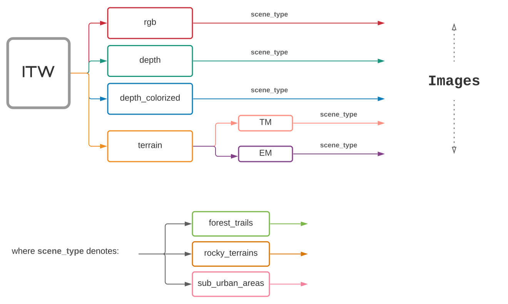

# Into The Wilderness Dataset (ITW)
Into The Wilderness (ITW) is a dataset that contains diverse wild outdoor scenes comprising of high-resolution RGB images with accurate and dense depth measurements, as well as color segmented terrain maps. ITW is the first public dataset to include **RGB-D images of completely outdoor and wild scenes obtained with a single RGB-D camera**.

- [1. Dataset Viewing](#1-dataset-viewing)
  - [1.1. Viewing links](#11-viewing-links)
  - [1.2. Terrain Segmentation Map Color Coding](#12-terrain-segmentation-map-color-coding)
- [2. Dataset Layout](#2-dataset-layout)
- [3. File Naming Conventions and Formats](#3-file-naming-conventions-and-formats)
- [4. DevKit](#4-devkit)
- [5. Contact](#5-contact)

## 1. Dataset Viewing

The train and test splits of Into The Wilderness are available for viewing, including RGB images, raw depth maps, processed depth maps and terrain segmentation maps.

### 1.1. Viewing links

|     Partition      |                     RGB                      | Raw Depth                                           |             Colorized Depth           | Terrain Segmented Maps |
| :----------------: | :------------------------------------------: | :-------------------------------------------------: | :-------------------------------------: | :------------: |
|    Train (4.8GB)    | [train_rgb](https://drive.google.com/drive/folders/1STwUaSCutmrqekYJZGKZ7XyfyvlWkCtk?usp=sharing) | [train_depth_raw](https://drive.google.com/drive/folders/1oJsfPLP5pUc53er2Y22o8QFK6Quxwu_0?usp=sharing) | [train_depth](https://drive.google.com/drive/folders/18PSbS__KZPy7mNA83PUDG3h8259Oht5O?usp=sharing) | [train_terrain](https://drive.google.com/drive/folders/1M2IgyzaAbVJ_Na80yYMKK5hG676gVedF?usp=sharing) |
| Test (0.8GB) | [test_rgb](https://drive.google.com/drive/folders/1Vrsp-hatlIXvWF1I2YcxYQv9LbCes1M4?usp=sharing) | [test_depth_raw](https://drive.google.com/drive/folders/1FsW4dHCppSDe-5_mJglHOhDQoQnGSFyO?usp=sharing) | [test_depth](https://drive.google.com/drive/folders/1cBCCPU5hcWdWDfdof1QIeLIl4GHzx0qu?usp=sharing) | [test_terrain](https://drive.google.com/drive/folders/1YhsEDsChikt1XLNuHYUIDoEsTVbLsDIj?usp=sharing) |

### 1.2. Terrain Segmentation Map Color Coding

| Color Hex Code | Terrain Class |
| :-: | :-: |
|  `#FFFF00` | Flat Surface |  
|  `#FA6404` | Dirt Trail |  
|  `#8D4205` | Traversable Rocky |  
|  `#CC9D33` | Sandy Trail |  
|  `#8ADA55` | Traversable Vegetation |  
|  `#D97373` | Semi-Traversable Rocky |  
|  `#467302` | Semi-Traversable Vegetation |  
|  `#646464` | Steps |  
|  `#235945` | Non-Traversable Vegetation |  
|  `#7A1631` | Non-Traversable Ditch |  
|  `#D11D05` | Obstacle |  
|  `#0D4CFF` | Water |  
|  `#04F1FA` | Background |  

## 2. Dataset Layout
The ITW dataset is organized hierarchically. Detailed structure for each provided data type is illustrated below:

## 3. File Naming Conventions and Formats
The dataset consists of RGB images, depth maps and terrain segmentation maps. Their formats are as follows:

- **RGB Images** `(*_rgb.png)` : RGB images with a resolution of `1920*1080`
- **Raw Depth Maps (Grayscale)** `(*_depth_gray.png)` : Raw Depth ground truth in grayscale, with a resolution of `1280*720`
- **Raw Depth Maps (Jet)** `(*_depth_jet.png)` : Raw Depth ground truth in jet color map, with a resolution of `1280*720`
- **Depth Maps** `(*_depth.png)` : Colorized Depth ground truth with a resolution of `1280*720`
- **Terrain Segmentation Map** `(*_TM.png)` : Color segmented terrain maps with the same resolution as the RGB images
- **Elevation Map** `(*_EM.png)` : Segmentation maps for the 'Incline' and 'Decline' classes, with the same resolution as the RGB images. Areas with no elevation are denoted with `#000000`

## 4. DevKit
This development toolkit contains:
1. A JSON file that enumerates the data in ITW. The layout of this file is explained in `itw.py`. It serves as the single point of reference during dataloading.
2. A sample pytorch data loading module.
3. A python file for computation of metrics using numpy.
4. A python file for capturing images using the Intel RealSense D415 Camera.

## 5. Contact
If you have any questions, please contact us at [iccv2021submission@gmail.com](iccv2021submission@gmail.com).
